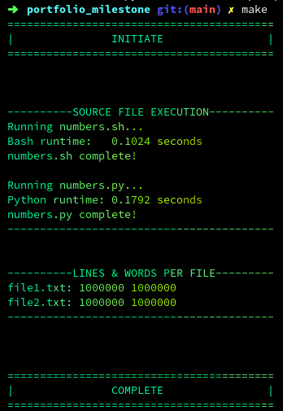

<h1>Module 3: Portfolio Milestone</h1>
<h2>

___Random Integer Generation___
</h2>

### Summary

&nbsp;&nbsp;&nbsp;&nbsp; Pictured below is a screenshot of the program running successfully and its output. The program is initiated via makefile automation. The makefile displays program information and runs both the Python and BASH versions of the random number generator. Furthermore, the runtime for each random number generator version is calculated and displayed, as well as the amount of lines and words produced by each version of the random integer generator.
&nbsp;   

  
_Program Output_
 

  
&nbsp;  

### Questions

___1. Describe the different methods you used to perform this task, with the times each one took.___  
&nbsp;&nbsp;&nbsp;&nbsp; In order to speed up my code, I implemented two different approaches. 
The first way to improve the runtime, was to take advantage of multithreading. Instead of using a single CPU core to produce all 1,000,000 random numbers, the task was broken down into smaller chunks, in order to run in each of their own cores. This was done by dividing the total desired quantity of random integers by the number of available CPU cores. Thus, enabling all the CPU cores to run a smaller chunk of the overall task simultaneously. For example, a computer with eight CPU cores means each core will generate 125,000(1,000,000 / 8 = 125,000) random integers, instead of a whopping million. Which provides a clear improved runtime. Secondly, was to have my code write to the final output file only once. Which enabled the avoidance of file locking and disk I/O contention, in a multithreaded environment. This was accomplished by having each core write to their own temporary output file. Once all threads have completed their subset of the overall task, all of their temporary files are combined into a single final output file.

___2. Explain why you chose each of those methods.___  
&nbsp;&nbsp;&nbsp;&nbsp; Multithreading was chosen to speed up the code by leveraging all of the available CPU cores. Thus, allowing the random integer generation task to be divided and executed in parallel, significantly reducing the overall processing time. Efficient file writing with temporary files was implemented to avoid bottlenecks caused by multiple processes trying to write to the final output file simultaneously. By writing to separate temporary files first and then merging afterwards, the script minimizes I/O contention, ensuring that the file system operations don't slow down the parallel execution. Which leads to an optimization in computation and disk usage. 

___3. Did each of these methods perform as you expected them to, or were there any surprises? Describe your findings in detail.___  
&nbsp;&nbsp;&nbsp;&nbsp; The methods performed as expected, with multithreading efficiently distributing the workload across multiple CPU cores, significantly speeding up the random number generation process. The temporary file handling also worked well, preventing I/O contention and ensuring smooth parallel execution. This design choice kept the workload balanced, and provided consistent performance.

___4. If your system had double its current processing power (CPU power), how much of an improvement would you expect for this process? Explain the reasons for that estimate, and provide references to support your opinion___  
&nbsp;&nbsp;&nbsp;&nbsp; If my computer system had double its current processing power, I would expect a near-linear improvement in processing speed. Leading to potentially reducing the runtime by approximately half. This is because the task is highly parallelizable, with the workload being distributed across all available CPU cores. Doubling the number of cores would allow for more simultaneous processes, each generating random numbers independently. However, the actual improvement could be slightly less than 50% due to factors such as system I/O limitations. Similar scenarios in parallel computing demonstrate similar performance gains. Furthermore, expected improvements often scaling closely with the number of available CPU cores in evenly distributed workloads.
