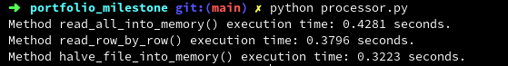

<h1>Module 4: Portfolio Milestone</h1>
<h2>

___Read. Double. Write.___
</h2>

### Overview

&nbsp;&nbsp;&nbsp;&nbsp; We compared three Python methods against each other and against a Bash method. Each with the task of processing a file(file1.txt) containing 1,000,000 random integers. The processing goal was to double each number, read into memory, and capture the execution times for all of the approaches.
&nbsp;   

### Outputs

  
<i>Bash Output</i>

  
<i>Python Output</i>

### Questions

 ___How do they compare to each other, and to that of the double_numbers.sh script?___  
 &nbsp;&nbsp;&nbsp;&nbsp; All four of the Python and Bash methods ran with similar execution times, at about one third of a second. However, the Python method to halve the input file and read each into memory ran the quickest. Whereas, the method to read the file line by line and read into memory ran the slowest. 
   
 ___Were there any surprises for you, or did the results match your expectations?___  
&nbsp;&nbsp;&nbsp;&nbsp; I assumed the Bash script would run quicker than the Python Script. Which was confirmed. However, I was surprised with how the Bash script ran about three times faster than the Python script. The Bash script has proved to be more efficient for this task.
